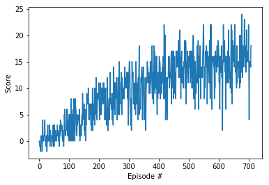

# Navigation

[//]: # (Image References)

[output_14_1]: ./output_14_1.png "Training Scores"

---

## Requirements

### Learning Algorithm

I utilized an implementation of OpenAI's Deep Q-Network from the famous paper: <em>Playing Atari with Deep Reinforcement Learning, Mnih et al, 2013. Algorithm: DQN</em>. Deep Q-Networks were groundbreaking in 2013 and while there have been a lot of improvements since then I wanted to start out with the original Deep Q-Networks.

#### Deep Q Networks

In Deep Q Networks there are two primary steps, the Sampling Process and the Learning Process.

##### Sampling

An agent has to explore the environment in order to learn what actions are best. Since the agent has no prior knowledge of how to achieve its goals, we have it start acting randomly. As the agent is exploring, it saves its experiences in experience replay tuples including the state, action taken, reward, next state. (S,A,R,S') After enough iterations the states and actions begin to have consistent reward signals associated with them and we can allow the agent to select the best actions using its learned policy.

For allowing the agent to explore the state action space, I used the epsilon-greedy approach. Epsilon is a number between 0 and 1 that slowly decreases and as we randomly draw a number between 0 and 1 <em>b</em> we evaluate if <em>b</em> is greater than epsilon. If epsilon is larger the agent performs a random action and if not the current best answer. This allows the agent enough opportunity to explore its options and optimize its behavior for success. 

##### Learning Process

After sampling a pre-determined number of episodes, the agent will update its policy using the stored experiences. We update the agent's policy by running the saved experiences with their rewards through our neural network. This policy is what will eventually be fined tuned and become the optimal policy, but one problem arises when using a function approximator: the agent uses the same policy to evaluate and update itself which leads to correlated results and a moving target. Let us review the update statement:

&Delta;w=&alpha;(R + &gamma;maxq&#770;(S',&alpha;,w)- q&#770;(S,A,w))&nabla;wq&#770;(S,A,w)
 The same w occurs three times in the equation, at the beginning because it is what we are updating, in the TD-target, and in the Q-Value. (See below) This means that as the TD-Target is updated during the back propagation, the difference between it and the Q-Value are changing and are not stable. It can be compared to chasing a moving target.

So what we do is we create a copy of the policy and use the copy to estimate the TD-Target. This allows the copy to stay the same and be stable while updating our policy. After each training cycle we bring the two together using the soft update method.

<em>TD-Target</em> = R + &gamma;maxq&#770;(S',&alpha;,w)
 
<em>Q-Value</em> = q&#770;(S,A,w)
 
<em>TD-error</em> = <em>TD-Target</em> - <em>Q-Value</em>

##### Network Architecture

The network is simple. Three fully connected layers with relu activation functions. The input size is the state space size and the output is the action space size. Both hidden layers are have 64 nodes. It is defined in the model.py file and is used for the policy's function approximator.

### Plot of Rewards

The algorithm solved the environment by episode 500 but continued on till it scored at least +15 on average which took 700 episodes.

### Ideas for Future Work

Deep Q-Networks tend to overestimate the reward for certain actions because they are greatly influenced by the experiences and actions they have explored. If the state action pair with the maximum value has the max due to random noise a series of incorrect actions will be performed and there is a chance other better actions won't be explored sufficiently to overcome the other actions. This limited exposure to situations can lead the agent to sub-optimal behavior. In practice making a simple change can correct this. Using a Double Q-Network as described in <em>Deep Reinforcement Learning with Double Q-learning 2015 by Hado van Hasselt, Arthur Guez, David Silver</em> will mitigate this problem. 

Prioritized experience replays can help train better Deep Q-Networks as well. Some actions lead to high rewards, but they don't happen frequently. Using an experience replay that prioritizes higher reward episodes will allow those infrequent experiences to have a greater influence on the agent's policy.

Many other improvements have been discovered by researchers in recent years, and I look forward to exploring them next time I implement Deep Q-Networks.
