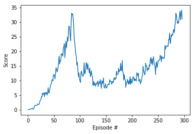

# Continuous Control Two Degree Freedom Arm Using Reinforcement Learning

[//]: # (Image References)

[output_14_1]: ./output_14_1.png "Training Scores"

---

## Summary

I utilized an implementation of DDPG from the paper: <em>Continuous control with deep reinforcement learning by Timothy P. Lillicrap, Jonathan J. Hunt, Alexander Pritzel, Nicolas Heess, Tom Erez, Yuval Tassa, David Silver, Daan Wierstra</em> to control the arms in the [Reacher](https://github.com/Unity-Technologies/ml-agents/blob/master/docs/Learning-Environment-Examples.md#reacher) environment.


## Actor Critic Methods

Actor critic methods are a group of algorithms that bring together value based and policy-based reinforcement learning (RL) algorithms to speed up convergence and improve the bias versus variance problems that each of the two methods struggle with.

As a reminder, value based methods like DQN approximate value functions such as the action-value function Qπ(S,A) which predicts rewards for actions when in a given state. These predictions are then used in a policy such as the epsilon-greedy policy to make decisions. On the other hand, policy-based methods approximate the policy directly outputting a probability distribution over the action space. This probability distribution is updated with new experiences until an optimal policy is reached.

Why combine them? Well policy-based methods require a lot of training data and have a lot of variance, but they will develop a good policy eventually. Value based methods on the other hand learn faster and are more consistent in their predictions, but they are not guaranteed to develop an optimal policy. If a value-based agent does not experience enough good state action pairs it won't update its policy sufficiently to achieve high performance. So, bringing them together allows the agent to learn with fewer data points and helps the agent find an optimal policy for sure.

The actor is the policy-based model learning the policy, and the critic is the value-based model evaluating the actions selected by the actor. They work together when they update each other’s weights. See below:

```
    # ---------------------------- update critic ---------------------------- #
    # Get predicted next-state actions and Q values from target models
    actions_next = self.actor_target(next_states)
    Q_targets_next = self.critic_target(next_states, actions_next)
    
    # Compute Q targets for current states (y_i)
    Q_targets = rewards + (gamma * Q_targets_next * (1 - dones))
    
    # Compute critic loss
    Q_expected = self.critic_local(states, actions)
    critic_loss = F.mse_loss(Q_expected, Q_targets)
    
    # Minimize the loss
    self.critic_optimizer.zero_grad()
    critic_loss.backward()
    self.critic_optimizer.step()
```

As you can see the critic is updated based on the decisions made by the actor. It does not use its own network to predict best actions. Below we can see that the actor is updated using the loss calculated by the critic.
```
 # ---------------------------- update actor ---------------------------- #
    # Compute actor loss
    actions_pred = self.actor_local(states)
    actor_loss = -self.critic_local(states, actions_pred).mean()
    
    # Minimize the loss
    self.actor_optimizer.zero_grad()
    actor_loss.backward()
    self.actor_optimizer.step()

```
This is how DDPG uses the actor critic paradigm to enable our RL agent to learn faster and more consistently.

In continuous control problems it can help to add noise to an agent’s predicted actions. This allows the agent to explore more of the continuous action space. It also takes place of the popular epsilon greedy policy for value-based methods in that it allows our agent to explore and exploit in a different way. In this implementation I used the Ornstein-Uhlenbeck process with the parameter epsilon to control how much noise is added. Epsilon decayed over time to reduce the amount of noise added.

## Model structure and hyper parameters

The model architectures for the actor and critic are simple. The actor's model consists of a fully connected layer with a leaky relu activation function followed by a batch normalization step. The model wraps up with two more fully connect layers with a leaky relu activation function and a tanh activation function for the last one. The layers sizes are as follows: (state size, 128, 128, action size). The critic model uses the same first two steps followed by a concatenation of the first two layers output and the action(s). The concatenated data is then fed to a fully connected leaky relu step and then to a linear fully connected layer at the end. The critic's layer sizes are: (state size, 128, 128 + action size, 128, 1). See classes Actor and Critic in the file model.py for the pytorch implementation.

The hyper parameters for the RL agent were as follows:
```
    BUFFER_SIZE = int(1e5)  # replay buffer size
    BATCH_SIZE = 256        # minibatch size
    GAMMA = 0.99            # discount factor
    TAU = 1e-3              # for soft update of target parameters
    LR_ACTOR = 1e-3         # learning rate of the actor 
    LR_CRITIC = 1e-3        # learning rate of the critic
    WEIGHT_DECAY = 0.0001   # L2 weight decay

    UPDATE_EVERY = 20       # Actor and critic only update every 20 steps
    UPDATE_TIMES = 10       # When they do update they update 10 times

    epsilon = 1.0           # Epsilon parameter that controls noise added to actions taken
    epsilon_decay = 1e-6    # decay amount to encourage more exploitation by the agent.

```

### Model Training Output
```
    Episode 20 	Score: 1.95	Average Score: 0.84
    Episode 40 	Score: 5.77	Average Score: 4.82
    Episode 60 	Score: 18.38	Average Score: 11.62
    Episode 80 	Score: 28.34	Average Score: 21.49
    Episode 100 	Score: 9.88	Average Score: 21.58
    Episode 120 	Score: 11.32	Average Score: 13.26
    Episode 140 	Score: 8.72	Average Score: 9.63
    Episode 160 	Score: 9.58	Average Score: 8.78
    Episode 180 	Score: 13.49	Average Score: 11.84
    Episode 200 	Score: 9.19	Average Score: 10.42
    Episode 220 	Score: 11.63	Average Score: 10.71
    Episode 240 	Score: 17.06	Average Score: 14.90
    Episode 260 	Score: 17.90	Average Score: 16.57
    Episode 280 	Score: 27.52	Average Score: 23.18
    Episode 296	Average Score (deque): 30.12
    Environment solved in 296 episodes!	Average Score: 30.12
```
<b>Moving Average Reward of the Twenty Agents</b>



## Future Improvement Ideas

There are other algorithms that have tried to improve upon DDPG's weaknesses such as Twin-Delayed DDPG also known as TD3. I would like to implement it and compare this algorithm’s performance against DDPG. A prioritized experience replay has been shown to improve model's performance and I have always wanted to understand it better. I would also like to use smart hyper parameter search methods to find hyper parameters that work with the environment and algorithm.

## Other reflections
Even after assuring myself multiple times that DDPG was implemented correctly I had to search a long time for hyper parameters that would work. When I say hyper parameters though I also explored different model architectures. Turns out my model started working a lot better when I did not initialize the weights using Kaiming Normal weights He et al (2015) which is one of the many things I tested. Another thing I did was I made sure the local and target networks were initialized the same for both the actor and critic. I also made sure to use different noise additions to the actions for each agent. These things and more were part of the struggle of getting my agent to learn.