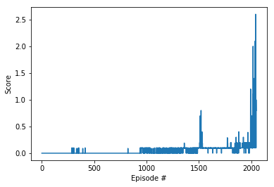

# Collaboration and Competition Agents Playing Table Tennis

[//]: # (Image References)

[output_14_0]: ./output_14_0.png "Training Scores"

---

## Summary

I utilized an implementation of DDPG from the paper: <em>Continuous control with deep reinforcement learning by Timothy P. Lillicrap, Jonathan J. Hunt, Alexander Pritzel, Nicolas Heess, Tom Erez, Yuval Tassa, David Silver, Daan Wierstra</em>, but I used multiple agents being controlled by a central policy to control them in the [Tennis](https://github.com/Unity-Technologies/ml-agents/blob/master/docs/Learning-Environment-Examples.md#tennis) environment.


## Method Used

In my previous project with the Reacher environment, I used DDPG with 20 agents to help the algorithm learn the policy faster. The 20 agents were learning together how to do the same task at the same time. They used a common replay experiences buffer and used the same policy but had different experiences to contribute. In this environment the two agents had the same task, but their position on the board was reversed and they had to cooperate with one another to be rewarded. For this task I also used the same replay buffer for both agents because they had a similar enough experience while learning to play Tennis.


## Model structure and hyper parameters

The model architectures for the actor and critic are simple. The actor's model consists of a fully connected layer with a leaky relu activation function followed by a batch normalization step. The model wraps up with two more fully connect layers with a leaky relu activation function and a tanh activation function for the last one. The layers sizes are as follows: (state size, 128, 128, action size). The critic model uses the same first two steps followed by a concatenation of the first two layers output and the action(s). The concatenated data is then fed to a fully connected leaky relu step and then to a linear fully connected layer at the end. The critic's layer sizes are: (state size, 128, 128 + action size, 128, 1). See classes Actor and Critic in the file model.py for the pytorch implementation.

The hyper parameters for the RL agent were as follows:
```
    BUFFER_SIZE = int(1e6)  # replay buffer size
    BATCH_SIZE = 256        # minibatch size
    GAMMA = 0.99            # discount factor
    TAU = 1e-3              # for soft update of target parameters
    LR_ACTOR = 1e-3         # learning rate of the actor 
    LR_CRITIC = 1e-3        # learning rate of the critic
    WEIGHT_DECAY = 0.0001        # L2 weight decay

    UPDATE_EVERY = 20
    UPDATE_TIMES = 10

    epsilon = 1.0
    epsilon_decay = 1e-5
```

### Model Training Output
```
    Episode 50 	Score: 0.00	Average Score: 0.00
    Episode 100 	Score: 0.00	Average Score: 0.00
    Episode 150 	Score: 0.00	Average Score: 0.00
    Episode 200 	Score: 0.00	Average Score: 0.00
    Episode 250 	Score: 0.00	Average Score: 0.00
    Episode 300 	Score: 0.00	Average Score: 0.00
    Episode 350 	Score: 0.00	Average Score: 0.01
    Episode 400 	Score: 0.00	Average Score: 0.01
    Episode 450 	Score: 0.00	Average Score: 0.00
    Episode 500 	Score: 0.00	Average Score: 0.00
    Episode 550 	Score: 0.00	Average Score: 0.00
    Episode 600 	Score: 0.00	Average Score: 0.00
    Episode 650 	Score: 0.00	Average Score: 0.00
    Episode 700 	Score: 0.00	Average Score: 0.00
    Episode 750 	Score: 0.00	Average Score: 0.00
    Episode 800 	Score: 0.00	Average Score: 0.00
    Episode 850 	Score: 0.00	Average Score: 0.00
    Episode 900 	Score: 0.00	Average Score: 0.00
    Episode 950 	Score: 0.00	Average Score: 0.02
    Episode 1000 	Score: 0.09	Average Score: 0.07
    Episode 1050 	Score: 0.00	Average Score: 0.05
    Episode 1100 	Score: 0.10	Average Score: 0.01
    Episode 1150 	Score: 0.09	Average Score: 0.02
    Episode 1200 	Score: 0.00	Average Score: 0.03
    Episode 1250 	Score: 0.10	Average Score: 0.05
    Episode 1300 	Score: 0.10	Average Score: 0.05
    Episode 1350 	Score: 0.10	Average Score: 0.06
    Episode 1400 	Score: 0.00	Average Score: 0.08
    Episode 1450 	Score: 0.00	Average Score: 0.03
    Episode 1500 	Score: 0.09	Average Score: 0.07
    Episode 1550 	Score: 0.10	Average Score: 0.16
    Episode 1600 	Score: 0.09	Average Score: 0.09
    Episode 1650 	Score: 0.10	Average Score: 0.09
    Episode 1700 	Score: 0.09	Average Score: 0.09
    Episode 1750 	Score: 0.10	Average Score: 0.09
    Episode 1800 	Score: 0.10	Average Score: 0.10
    Episode 1850 	Score: 0.09	Average Score: 0.09
    Episode 1900 	Score: 0.10	Average Score: 0.10
    Episode 1950 	Score: 0.19	Average Score: 0.12
    Episode 2000 	Score: 0.20	Average Score: 0.14
    Episode 2048	Average Score (deque): 0.50
    Environment solved in 2048 episodes!	Average Score: 0.50
```

#### Average Max Reward Between the Two Agents Over 100 Episodes



## Future Improvement Ideas

Next time I would like to explore other cooperation tasks that might not work when I plug in the DDPG algorithm with only minor adjustments. I want to investigate ways to make my agents learn faster because this environment ran quickly, so I was able to wait more than 2000 episodes in a short amount of time. I would like to implement TD3 and use smart hyperparameter optimization techniques.

